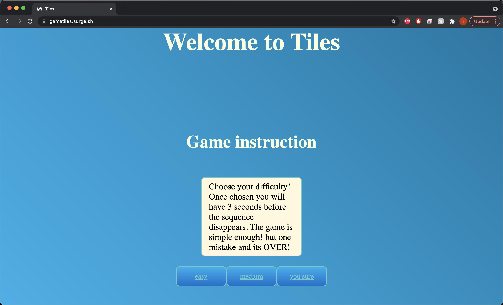
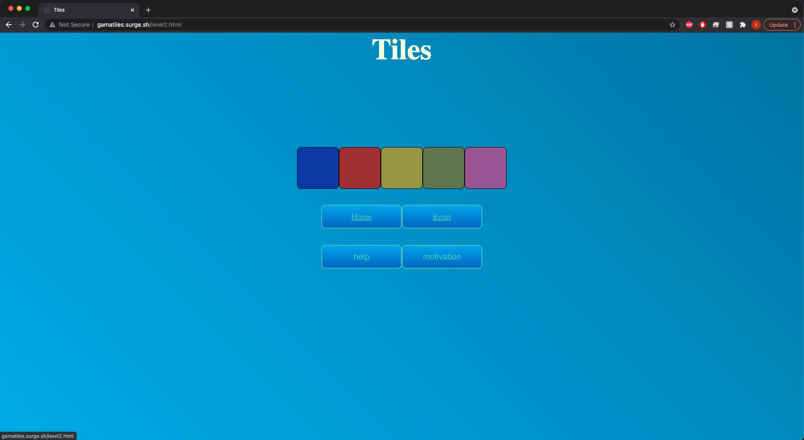

# [Tiles](http://gamatiles.surge.sh/)

## Date: 08/13/2021

### By: Itallo Gama

[GitHub](https://github.com/ItalloGama) |
[Instagram](https://www.instagram.com/gamarayz94/)|
[LinkedIn](https://www.linkedin.com/in/itallo-gama/)|
[Trello](https://trello.com/b/ndBnqoPe/memory-game)
***

## ***The game to test your memory***
### ***Description***
* Choose your difficulty! Once chosen you will have three seconds before the sequence disappears. The "sequence" button will reset and re-populate the sequence. The game is simple enough! but one mistake and its over. May the tiles be ever in your favor.

### ***Techmologies used***

* HTML
* CSS
* JavaScript
* GitHub

### ***Getting started***

* Go to the [Tiles](https://gamatiles.surge.sh/index.html) website.

### ***Future Updates***
* Illumination uppon order for sequence
* Button graphic updates
* Extra levels

### Screenshot

***
***credits***
* Thank you [Kevin Powell](https://www.youtube.com/kepowob), subscribe to his youtube page for fantastic CSS content.
* Thank you to [W3Schools](https://www.w3schools.com/), for the general help and instructive information.
* Thank you to [MDN Web Docs](https://developer.mozilla.org/en-US/), for the general help and instructive information.
* Thank you to[Stack Overflow](https://stackoverflow.com/), for the general help and instructive information.

